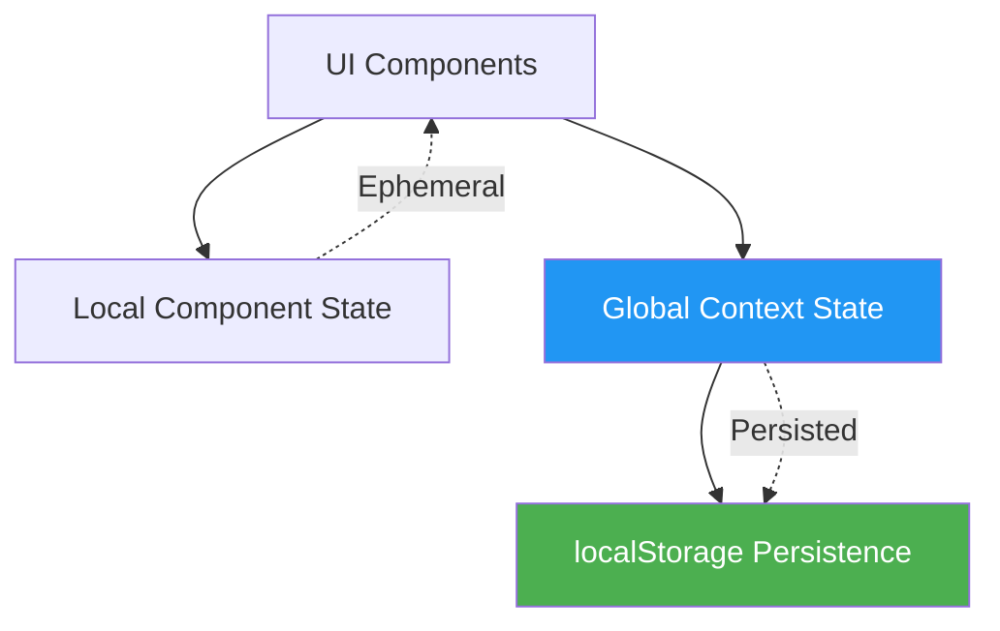
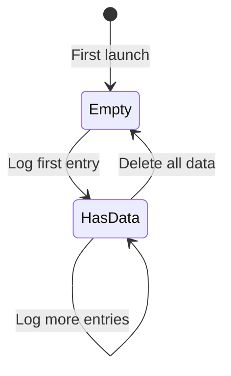
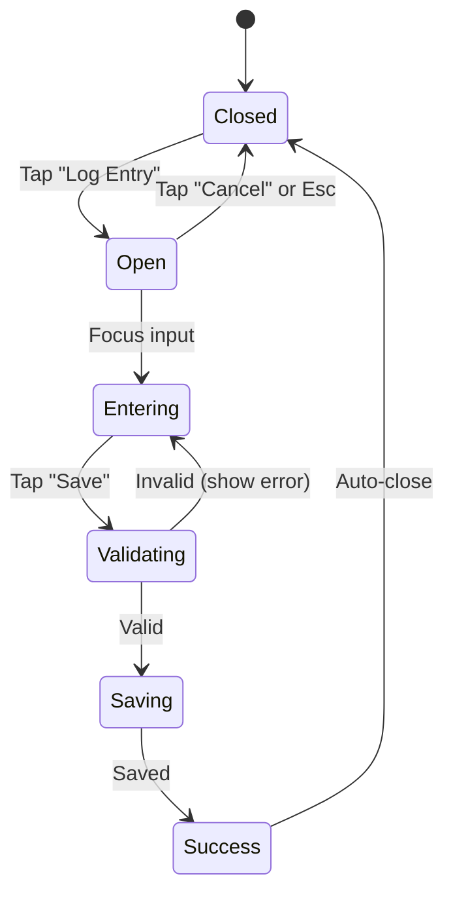
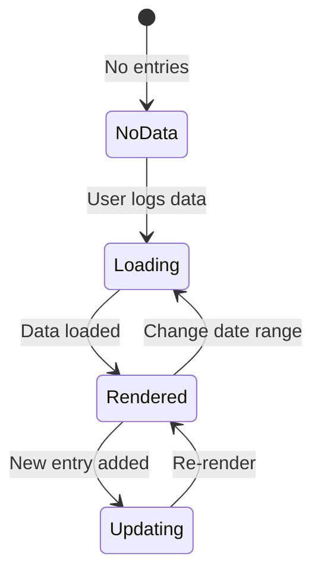
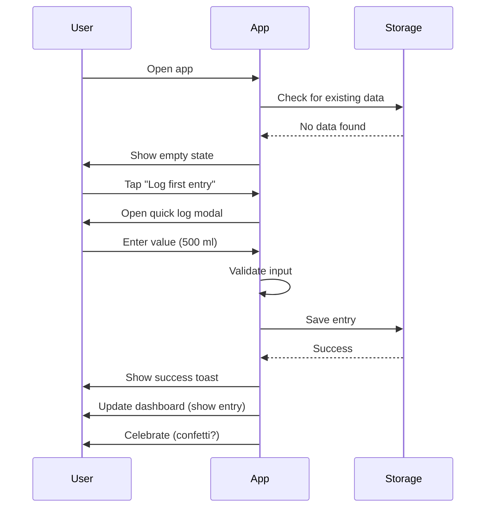
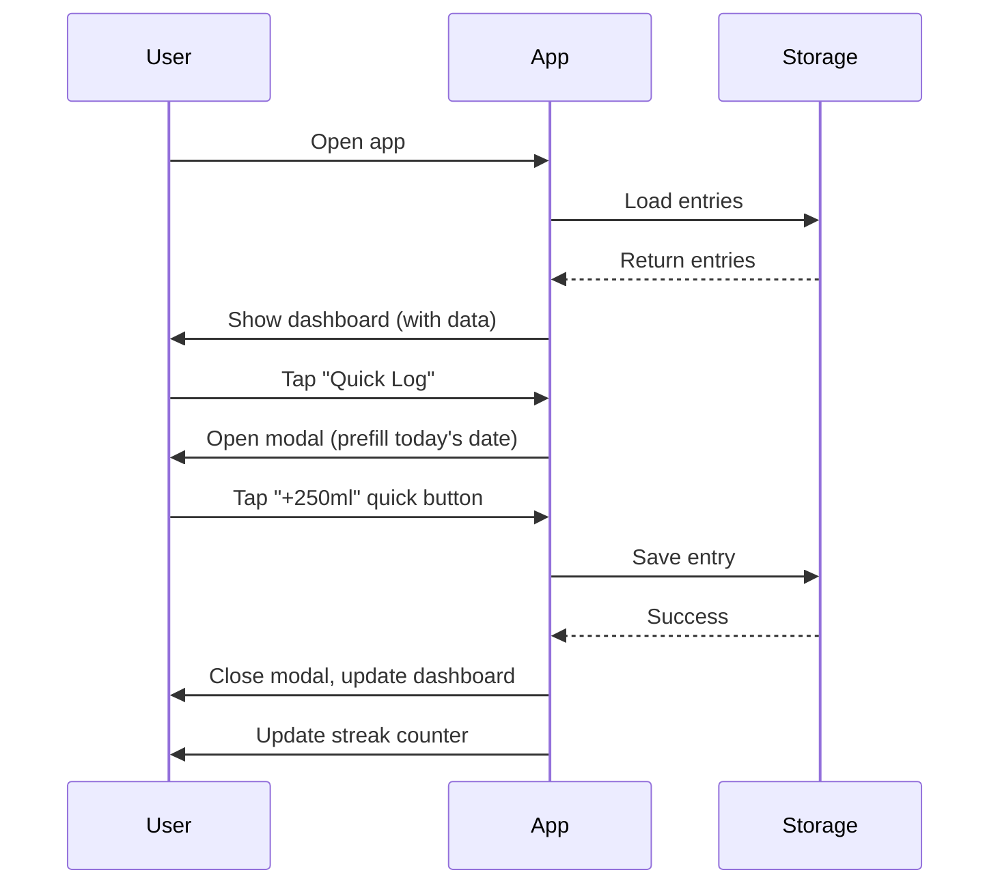
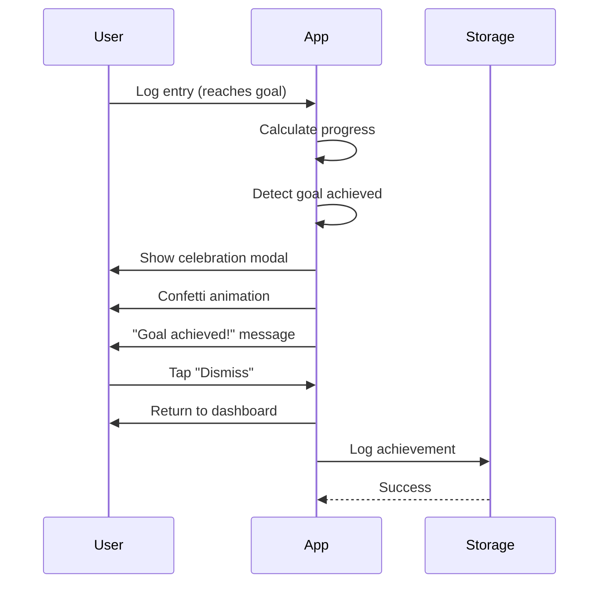
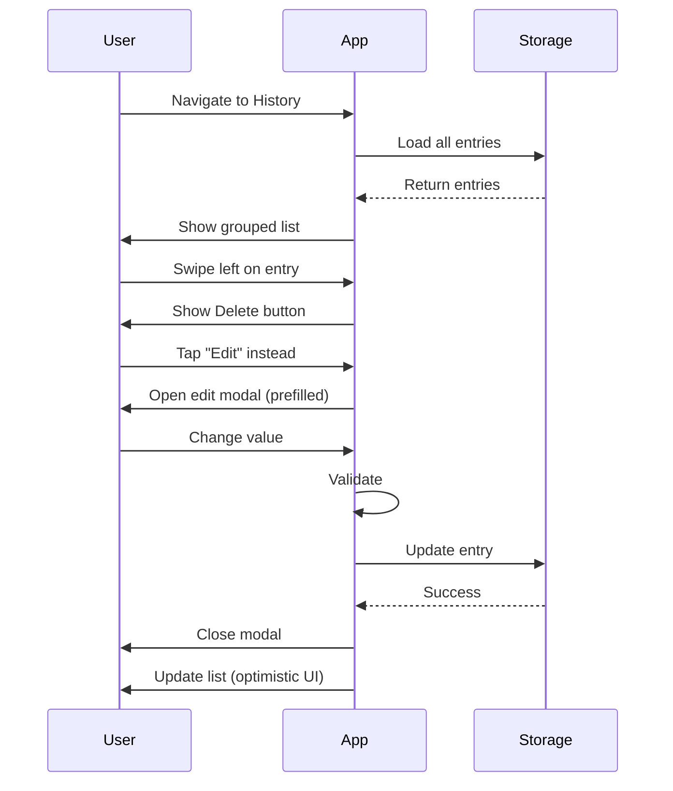

# Key States & Transitions

## Overview

Partner Showcase uses **React state management** (Context API + localStorage) to handle application state. This document maps key states, transitions, and user interactions.

---

## State Architecture

### State Layers



**Local State**: Temporary UI state (modal open, form inputs)
**Global State**: App-wide data (entries, goals, settings)
**Persistent State**: Synced to localStorage on change

---

## Core Data States

### Entries State
```typescript
interface EntriesState {
  entries: Entry[];
  loading: boolean;
  error: string | null;
  lastSync: Date | null;
}

interface Entry {
  id: string;
  timestamp: Date;
  value: number;
  unit: string;
  notes?: string;
  goalId?: string;
}
```

**Transitions**:
1. **Empty** → User logs first entry → **Has Data**
2. **Has Data** → User deletes all → **Empty**
3. **Synced** → User makes edit → **Pending Sync** (if backend exists)

---

### Goals State
```typescript
interface GoalsState {
  goals: Goal[];
  activeGoalId: string | null;
  loading: boolean;
  error: string | null;
}

interface Goal {
  id: string;
  name: string;
  target: number;
  unit: string;
  frequency: 'daily' | 'weekly';
  isActive: boolean;
  createdAt: Date;
}
```

**Transitions**:
1. **No Goals** → User creates goal → **Has Goals**
2. **Has Goals** → User achieves goal → **Goal Completed** (celebration)
3. **Active Goal** → User pauses → **Inactive Goal**

---

### Settings State
```typescript
interface SettingsState {
  theme: 'light' | 'dark' | 'auto';
  unit: 'ml' | 'oz';
  notifications: boolean;
  reminderTime: string; // "09:00"
  language: string;
}
```

**Transitions**:
- Settings update immediately (optimistic)
- Persisted to localStorage on change
- No loading states (instant)

---

## UI States

### Dashboard States

#### Empty State
**Trigger**: No entries logged yet
**UI**:
- Empty state illustration
- "Get started" message
- "Log your first entry" CTA
- "Set a goal" CTA



---

#### Has Data State
**Trigger**: At least 1 entry exists
**UI**:
- Quick stats cards
- Recent entries list
- Progress visualization
- Quick log button

**Sub-states**:
- **On Track**: Progress ≥ goal
- **Behind**: Progress < goal
- **No Goal Set**: Show suggestion to set goal

---

#### Loading State
**Trigger**: Initial data load (< 100ms usually)
**UI**:
- Skeleton screens
- Shimmer effect
- No spinner

---

#### Error State
**Trigger**: Data load fails (rare, localStorage should always work)
**UI**:
- Error message
- "Retry" button
- "Clear cache" option

---

### Quick Log States



**State Details**:

1. **Closed**: Modal not visible
2. **Open**: Modal visible, input focused
3. **Entering**: User typing value
4. **Validating**: Check value > 0, < max
5. **Saving**: Write to localStorage
6. **Success**: Show toast, close modal

**Timing**:
- Open animation: 200ms
- Save duration: < 50ms (localStorage)
- Success toast: 2s
- Auto-close: After success

---

### Progress Chart States



**State Details**:

1. **No Data**: Empty state with CTA
2. **Loading**: Skeleton chart
3. **Rendered**: Chart with data
4. **Updating**: Smooth transition to new data

**Performance**:
- Debounce updates: 300ms
- Use React.memo to prevent unnecessary re-renders
- Virtualize long lists

---

## User Interaction Flows

### Flow 1: First-Time User Experience



**Duration**: ~30 seconds
**Success Metric**: User completes first log

---

### Flow 2: Daily Logging (Returning User)



**Duration**: ~5 seconds
**Success Metric**: Entry logged quickly

---

### Flow 3: Goal Achievement



**Duration**: ~3 seconds
**Success Metric**: User feels rewarded

---

### Flow 4: Editing Past Entry



**Duration**: ~10 seconds
**Success Metric**: Edit saves correctly

---

## Transition Animations

### Modal Transitions
**Open**: Slide up from bottom (mobile) or fade in (desktop)
**Close**: Slide down or fade out
**Duration**: 200ms
**Easing**: cubic-bezier(0.4, 0, 0.2, 1)

### Page Transitions
**Enter**: Fade in + slide right
**Exit**: Fade out
**Duration**: 150ms

### List Animations
**Add Item**: Slide in from top
**Remove Item**: Slide out + fade
**Reorder**: Smooth position change

### Success States
**Toast**: Slide in from top
**Confetti**: Particle burst (on goal achievement)
**Progress Bar**: Smooth fill animation

---

## Offline Behavior

### States
1. **Online**: Normal operation
2. **Offline**: All features work (local-first)
3. **Reconnecting**: If backend exists, sync pending changes

### Offline-First Strategy
**Principle**: App works 100% offline, sync is optional

**User Experience**:
- No "You're offline" error
- Data saves to localStorage immediately
- Sync icon shows pending changes (if backend)
- Auto-sync when online

---

## Error Recovery

### Validation Errors
**Strategy**: Prevent invalid states
**Example**: Disable "Save" until valid

### Storage Errors
**Strategy**: Graceful degradation
**Example**: If localStorage full, show warning + export option

### Unexpected Errors
**Strategy**: Error boundary
**Example**: Catch React errors, show fallback UI

---

## State Persistence

### localStorage Schema
```json
{
  "hydrotrack_entries": [...],
  "hydrotrack_goals": [...],
  "hydrotrack_settings": {...},
  "hydrotrack_lastSync": "2025-10-24T12:00:00Z"
}
```

### Sync Strategy
- Save on every mutation
- Debounced writes (100ms)
- Atomic updates (all-or-nothing)

---

## References

**State Management**:
- React Context API
- localStorage Web API
- React Router state

**PRD Cross-References**:
- See `prd/03-acceptance-criteria.md` for feature states
- See `architecture-data-model.md` for data schemas
