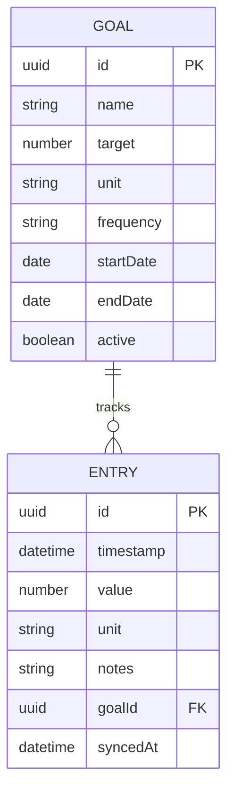

# Data Model Architecture

## Entity Overview

HydroTrack uses a **simple, normalized schema** optimized for local storage with optional cloud sync capability.

**Core Entities**:
- **Entry**: Individual tracking record (e.g., 250ml water logged at 2pm)
- **Goal**: User-defined target (e.g., drink 2L water daily)

---

## Entity Definitions

### Entry

**Purpose**: Represents a single tracking event (e.g., water logged, workout completed)

**Schema**:
| Field | Type | Required | Description |
|-------|------|----------|-------------|
| `id` | UUID | Yes | Unique identifier (client-generated) |
| `timestamp` | DateTime | Yes | When entry was created (ISO 8601) |
| `value` | Number | Yes | Tracked value (e.g., 250ml water, 30min exercise) |
| `unit` | String | Yes | Unit of measurement ('ml', 'min', 'reps') |
| `notes` | String | No | Optional user notes (max 500 chars) |
| `goalId` | UUID | No | Associated goal (foreign key) |
| `createdAt` | DateTime | Yes | Record creation timestamp |
| `updatedAt` | DateTime | Yes | Last modification timestamp |
| `syncedAt` | DateTime | No | Last cloud sync timestamp (if backend exists) |

**TypeScript Interface**:
```typescript
interface Entry {
  id: string;                    // UUID v4
  timestamp: Date;               // ISO 8601 string
  value: number;                 // Positive number
  unit: 'ml' | 'min' | 'reps';  // Enum
  notes?: string;                // Optional, max 500 chars
  goalId?: string;               // UUID v4 (nullable)
  createdAt: Date;
  updatedAt: Date;
  syncedAt?: Date;               // Nullable
}
```

**Validation Rules**:
- `id`: Must be valid UUID v4
- `value`: Must be positive number, max 100,000
- `notes`: Max 500 characters, sanitized for XSS
- `timestamp`: Cannot be in future

**Prisma Schema** (if backend added):
```prisma
model Entry {
  id        String   @id @default(uuid())
  timestamp DateTime
  value     Float
  unit      String
  notes     String?  @db.VarChar(500)
  goalId    String?
  goal      Goal?    @relation(fields: [goalId], references: [id])
  createdAt DateTime @default(now())
  updatedAt DateTime @updatedAt
  syncedAt  DateTime?

  @@index([timestamp])
  @@index([goalId])
}
```

**Indexes**:
- `timestamp`: For chronological queries (history view)
- `goalId`: For goal-specific filtering

---

### Goal

**Purpose**: User-defined targets for tracking

**Schema**:
| Field | Type | Required | Description |
|-------|------|----------|-------------|
| `id` | UUID | Yes | Unique identifier |
| `name` | String | Yes | Goal name (e.g., "Daily Water Intake") |
| `target` | Number | Yes | Target value (e.g., 2000ml) |
| `unit` | String | Yes | Same units as entries |
| `frequency` | String | Yes | 'daily', 'weekly', 'monthly' |
| `startDate` | Date | Yes | When goal begins |
| `endDate` | Date | No | Optional end date (null = ongoing) |
| `active` | Boolean | Yes | Whether goal is currently active |
| `createdAt` | DateTime | Yes | Record creation |
| `updatedAt` | DateTime | Yes | Last modification |

**TypeScript Interface**:
```typescript
interface Goal {
  id: string;
  name: string;                           // Max 100 chars
  target: number;                         // Positive number
  unit: 'ml' | 'min' | 'reps';
  frequency: 'daily' | 'weekly' | 'monthly';
  startDate: Date;
  endDate?: Date;                         // Nullable
  active: boolean;
  createdAt: Date;
  updatedAt: Date;
}
```

**Validation Rules**:
- `name`: 1-100 characters, non-empty
- `target`: Positive number, max 1,000,000
- `endDate`: Must be after `startDate` if set

**Prisma Schema** (if backend added):
```prisma
model Goal {
  id        String   @id @default(uuid())
  name      String   @db.VarChar(100)
  target    Float
  unit      String
  frequency String
  startDate DateTime
  endDate   DateTime?
  active    Boolean  @default(true)
  entries   Entry[]
  createdAt DateTime @default(now())
  updatedAt DateTime @updatedAt

  @@index([active])
}
```

---


---

## Entity Relationships




**Relationship Rules**:
- One Goal can have many Entries (one-to-many)
- One Entry belongs to zero or one Goal (optional)

- Deleting a Goal does NOT delete its Entries (orphan handling)


---

## Storage Strategy

### Local Storage Schema
**Key**: `hydrotrack-data`

**Value**: JSON-serialized object
```typescript
interface LocalStorageSchema {
  version: number;              // Schema version for migrations
  entries: Entry[];             // Array of all entries
  goals: Goal[];                // Array of all goals
  preferences: {                // User preferences
    theme: 'light' | 'dark';
    notifications: boolean;
    exportReminder: boolean;
  };
  lastExport?: Date;            // Last data export timestamp
  lastSync?: Date;              // Last cloud sync (if applicable)
}
```

**Size Estimate**:
- Average entry: ~150 bytes
- Average goal: ~100 bytes
- 365 entries/year × 10 years = ~540 KB
- Well within 5MB localStorage limit

---

### IndexedDB Schema (Future Migration)
**Database**: `HydroTrackDB`

**Object Stores**:
```typescript
// Entries store
{
  name: 'entries',
  keyPath: 'id',
  indexes: [
    { name: 'timestamp', keyPath: 'timestamp' },
    { name: 'goalId', keyPath: 'goalId' }
  ]
}

// Goals store
{
  name: 'goals',
  keyPath: 'id',
  indexes: [
    { name: 'active', keyPath: 'active' }
  ]
}
```

**Migration Trigger**: When localStorage approaches 4MB (80% capacity)

---

## Data Integrity

### Validation
**Client-Side** (TypeScript + Zod):
```typescript
import { z } from 'zod';

const EntrySchema = z.object({
  id: z.string().uuid(),
  timestamp: z.date().max(new Date()),
  value: z.number().positive().max(100000),
  unit: z.enum(['ml', 'min', 'reps']),
  notes: z.string().max(500).optional(),
  goalId: z.string().uuid().optional(),
});

// Validate before saving
const entry = EntrySchema.parse(userInput);
```

**Server-Side** (if backend exists):
- Same Zod schemas
- Database constraints (Prisma)
- Rate limiting on mutations

---

### Backup & Recovery
**Export Format**: JSON
```json
{
  "version": 1,
  "exportedAt": "2025-10-24T12:00:00Z",
  "entries": [...],
  "goals": [...],
  "checksum": "sha256-hash-of-data"
}
```

**Import Process**:
1. Validate JSON structure
2. Check schema version
3. Verify checksum
4. Merge or replace existing data (user choice)
5. Confirm success

---

## Performance Optimization

### Query Patterns
**Common Queries**:
1. Get recent entries (last 7 days)
2. Get entries for specific goal
3. Calculate progress toward goal
4. Export all data

**Optimization**:
- Keep entries sorted by timestamp in memory
- Cache goal progress calculations
- Lazy-load old entries (only show recent by default)

### Caching Strategy
```typescript
// Cache calculated values
const cache = {
  todayProgress: null as number | null,
  weekStats: null as Stats | null,
  lastCalculated: null as Date | null,
};

// Invalidate on new entry
function addEntry(entry: Entry) {
  entries.push(entry);
  cache.todayProgress = null;  // Recalculate
  cache.weekStats = null;
  saveToStorage(entries);
}
```

---

## Migration Strategy

### Schema Versioning
```typescript
const migrations = {
  0: (data: any) => {
    // Initial schema (no migration needed)
    return { version: 1, ...data };
  },
  1: (data: SchemaV1) => {
    // Example: Add 'unit' field to old entries
    return {
      version: 2,
      entries: data.entries.map(e => ({ ...e, unit: 'ml' })),
      goals: data.goals,
    };
  },
};

function loadData(): LocalStorageSchema {
  const raw = localStorage.getItem('hydrotrack-data');
  if (!raw) return initialSchema;

  let data = JSON.parse(raw);
  const currentVersion = data.version || 0;
  const targetVersion = Object.keys(migrations).length;

  // Run migrations sequentially
  for (let v = currentVersion; v < targetVersion; v++) {
    data = migrations[v](data);
  }

  return data;
}
```

---

## Data Privacy & Compliance

### GDPR Compliance
- **Right to Access**: Export data as JSON (one-click)
- **Right to Erasure**: "Delete All Data" button (irreversible)
- **Data Portability**: Standard JSON format
- **Data Minimization**: Only collect what's needed

### Data Retention
**Local Storage**:
- Data persists until user clears browser or deletes app
- No automatic deletion

**Cloud Sync** (if backend):
- Inactive accounts deleted after 2 years
- User can request deletion anytime
- 30-day soft delete (recovery window)

---

## References

**Data Modeling**:
- [Database Normalization](https://en.wikipedia.org/wiki/Database_normalization)
- [Prisma Best Practices](https://www.prisma.io/docs/guides/performance-and-optimization)
- [IndexedDB API](https://developer.mozilla.org/en-US/docs/Web/API/IndexedDB_API)

**PRD Cross-References**:
- See `prd/03-acceptance-criteria.md` for data requirements
- See `architecture-api.md` for API data contracts
