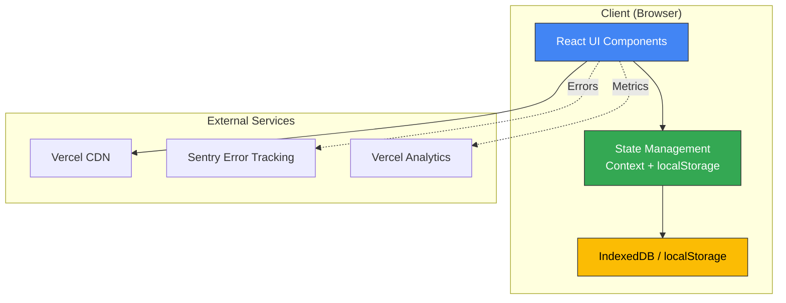
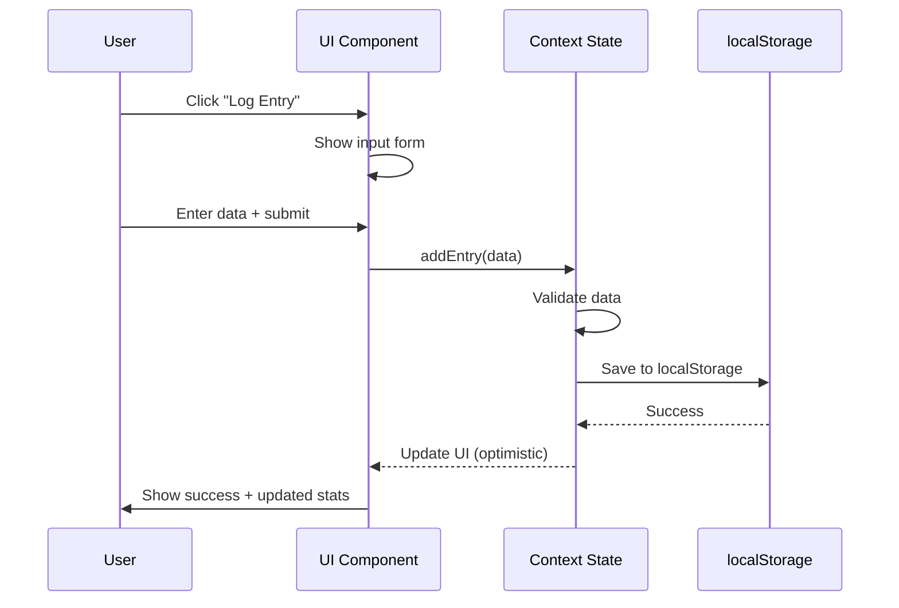
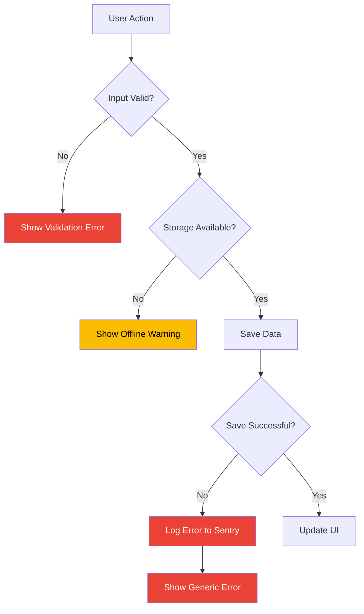
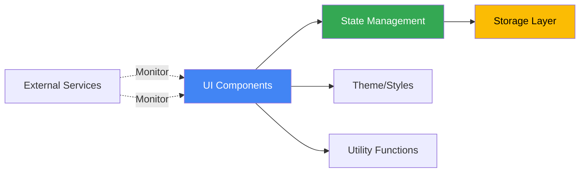

# Service & Module Architecture

## System Overview

HydroTrack follows a **client-only** architecture with emphasis on **local-first data** and **progressive enhancement**.

## Architecture Diagram



---

## Module Breakdown

### Frontend Modules

#### 1. UI Layer
**Path**: `src/components/`

**Responsibilities**:
- Render user interface
- Handle user interactions
- Display data from state

**Sub-modules**:
```
src/components/
├── screens/           # Full-screen views
│   ├── DashboardScreen.tsx
│   ├── LogEntryScreen.tsx
│   ├── HistoryScreen.tsx
│   ├── AnalyticsScreen.tsx
│   └── SettingsScreen.tsx
├── ui/                # Reusable components
│   ├── PillButton.tsx
│   ├── MetricCard.tsx
│   ├── ProgressBar.tsx
│   ├── Input.tsx
│   └── Navigation.tsx
└── layout/            # Layout components
    ├── AppHeader.tsx
    ├── AppFooter.tsx
    └── AppLayout.tsx
```

**Key Patterns**:
- **Screen Components**: Full pages, receive data from Context
- **UI Components**: Reusable, accept props, no state
- **Layout Components**: Wrapper/structure, provide navigation

**Dependencies**:
- React 18+ (hooks, suspense)
- CSS Modules (scoped styles)

---

#### 2. State Management Layer
**Path**: `src/context/`

**Responsibilities**:
- Manage application state
- Sync with localStorage
- Provide data to UI components

**Modules**:
```typescript
// src/context/DataContext.tsx
interface DataContextType {
  entries: Entry[];
  goals: Goal[];
  addEntry: (entry: Omit<Entry, 'id'>) => void;
  updateGoal: (goal: Goal) => void;
  deleteEntry: (id: string) => void;
  exportData: () => string;
  importData: (json: string) => void;
}

// State lifecycle:
// 1. Load from localStorage on mount
// 2. Update state via Context methods
// 3. Auto-save to localStorage on change
// 4. Optional: sync to backend
```

**Storage Strategy**:
- **Primary**: localStorage (5MB limit, sync API)
- **Fallback**: sessionStorage (temporary)
- **Future**: IndexedDB (unlimited, async API)

**Dependencies**:
- React Context API
- localStorage API (native)

---

#### 3. Data Persistence Layer
**Path**: `src/lib/storage.ts`

**Responsibilities**:
- Abstract storage implementation
- Handle serialization/deserialization
- Manage migrations

**Interface**:
```typescript
interface StorageAdapter {
  get<T>(key: string): T | null;
  set<T>(key: string, value: T): void;
  remove(key: string): void;
  clear(): void;
  keys(): string[];
}

class LocalStorageAdapter implements StorageAdapter {
  // Implementation using localStorage
}

class IndexedDBAdapter implements StorageAdapter {
  // Future: Implementation using IndexedDB
}
```

**Migration System**:
```typescript
// Versioned schema for upgrades
const SCHEMA_VERSION = 1;

interface StorageSchema_V1 {
  version: 1;
  entries: Entry[];
  goals: Goal[];
}

// Migration functions
const migrations = {
  0: (data: any) => ({ version: 1, ...data }),
  // Future: 1: (data) => migrate_v1_to_v2(data)
};
```

---


---

## Data Flow Diagrams

### Core Feature: Water logging



---

### Error Handling Flow



---

## Module Dependencies



---

## Cross-Cutting Concerns

### Error Handling
**Strategy**: Defensive programming + graceful degradation

**Layers**:
1. **UI**: Try-catch around user interactions
2. **State**: Validate all data before storage
3. **Storage**: Fallback to sessionStorage if localStorage full
4. **N/A**: Not applicable

**Error Reporting**:
- **Development**: Console errors + React Error Boundaries
- **Production**: Sentry (batched, sampled)

---

### Logging
**Strategy**: Structured logging with levels

**Levels**:
- `ERROR`: Exceptions, failed operations
- `WARN`: Degraded functionality, missing features
- `INFO`: User actions, lifecycle events
- `DEBUG`: Development only

**Implementation**:
```typescript
const logger = {
  error: (msg: string, meta?: object) => {
    console.error(msg, meta);
    if (isProd) sentry.captureException(new Error(msg));
  },
  warn: (msg: string) => console.warn(msg),
  info: (msg: string) => console.log(msg),
  debug: (msg: string) => !isProd && console.debug(msg),
};
```

---

### Testing Strategy
**Approach**: Visual QA + Unit Tests

**Test Pyramid**:
```
           /\
          /  \  Manual Testing (smoke tests)
         /____\
        / E2E  \  Visual QA (Playwright) - 9 scenarios
       /________\
      / Integ.  \  Component Testing - Key flows
     /__________\
    /   Unit     \  Pure Functions - Utils, validators
   /______________\
```

**Tools**:
- **Visual QA**: Playwright (already integrated)
- **Unit**: Vitest (fast, ESM-native)
- **E2E**: Playwright (full user flows)

---

## Scalability Considerations

### Performance Targets
- **Initial Load**: < 2s (3G network)
- **Entry Creation**: < 100ms (localStorage write)
- **Data Export**: < 500ms (serialize to JSON)
- **N/A**: Not applicable

### Capacity Planning
**Local Storage**:
- Average entry size: ~100 bytes
- 5MB limit = ~50,000 entries
- Sufficient for 10+ years of daily tracking


### Bottlenecks & Mitigations
| Bottleneck | Impact | Mitigation |
|------------|--------|------------|
| localStorage full | Cannot save new entries | Migrate to IndexedDB (unlimited) |
| Slow render | Laggy UI | Virtualize long lists, memo components |
| N/A | N/A | N/A |
| Bundle size | Slow initial load | Code splitting, lazy loading |

---

## Security Architecture

### Threat Model
**Attack Vectors**:
1. **XSS**: Malicious scripts in user input
2. **CSRF**: Forged requests (N/A - local-only)
3. **Data Loss**: localStorage cleared/corrupted
4. **N/A**: Not applicable

**Mitigations**:
1. **XSS**: React auto-escapes, CSP headers
2. **CSRF**: Not applicable
3. **Data Loss**: Export feature, backups encouraged
4. **N/A**: Not applicable

### Defense in Depth
```
User Input
  ↓
[Client Validation] ← TypeScript types
  ↓
[React XSS Protection] ← Auto-escaping
  ↓
[localStorage] ← Sanitized
  ↓
[Render] ← React
  ↓
[Display]
```

---

## Module Ownership (Future)

As team grows, suggest ownership model:

| Module | Owner | Backup |
|--------|-------|--------|
| UI Components | Frontend Lead | Designer |
| State Management | Frontend Lead | Backend Lead |
| API Layer | Backend Lead | DevOps |
| Database | Backend Lead | DBA (if hired) |
| DevOps/Deploy | DevOps Lead | Backend Lead |
| Security | Security Lead | All |

**For MVP**: Single developer owns all modules

---

## References

**Architecture Patterns**:
- [Local-First Software](https://www.inkandswitch.com/local-first/)
- [React Architecture](https://react.dev/learn/thinking-in-react)
- [Next.js App Router](https://nextjs.org/docs/app)

**PRD Cross-References**:
- See `prd/03-acceptance-criteria.md` for feature requirements
- See `architecture-data-model.md` for schema details
- See `architecture-api.md` for endpoint specs
