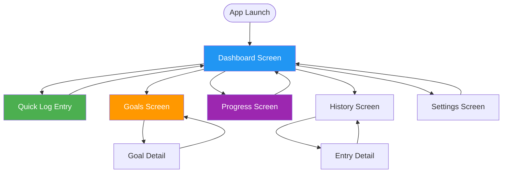

# Screen Map & Navigation

## Overview

HydroTrack follows a **single-page application (SPA)** architecture with client-side routing. The navigation structure prioritizes quick access to core features with minimal clicks.

**Navigation Pattern**: Hub-and-spoke (Dashboard as central hub)

---

## Screen Hierarchy



---

## Screen Inventory

### 1. Dashboard (Home Screen)
**Route**: `/`
**Purpose**: Central hub for all app functionality

**Components**:
- Quick stats summary (today's progress)
- Quick log button (primary CTA)
- Recent entries list (last 5)
- Goal progress rings
- Navigation menu

**Navigation**:
- → Quick Log (modal/slide-up)
- → Goals (link)
- → Progress (link)
- → History (link)
- → Settings (menu)

**Empty State**:
- Welcome message
- "Set your first goal" CTA
- "Log your first entry" CTA

---

### 2. Quick Log Entry
**Route**: `/log` (or modal overlay)
**Purpose**: Fast data entry for daily tracking

**Components**:
- Numeric input (with increment/decrement buttons)
- Unit selector (ml/oz for water)
- Timestamp picker (defaults to now)
- Notes field (optional)
- Save button (primary)
- Cancel button (secondary)

**Interaction Flow**:
1. User taps "Log Entry" on dashboard
2. Modal slides up from bottom
3. Focus on numeric input
4. User enters value (keyboard or +/- buttons)
5. Tap "Save"
6. Success toast → return to dashboard

**Validation**:
- Value must be > 0
- Value must be < 10000 (sanity check)
- Timestamp cannot be future

**Keyboard Shortcuts**:
- `Cmd+N` - Open quick log
- `Enter` - Save
- `Esc` - Cancel

---


### 3. Goals Screen
**Route**: `/goals`
**Purpose**: View and manage daily/weekly goals

**Components**:
- Active goals list
- Goal progress bars
- "Add Goal" button
- Goal cards (editable inline)

**Goal Card**:
- Goal name
- Target value + unit
- Current progress (%)
- Progress bar (visual)
- Edit/Delete actions

**Interaction Flow**:
1. View list of goals
2. Tap "Add Goal"
3. Enter goal details (name, target, frequency)
4. Save → goal appears in list
5. Dashboard updates with new goal

**Empty State**:
- "No goals yet" message
- "Create your first goal" CTA
- Suggested goals (e.g., "Drink 2L daily")

---


### 4. Progress Screen
**Route**: `/progress`
**Purpose**: Visualize trends and analytics

**Components**:
- Date range selector (7d, 30d, 90d, All)
- Chart (line or bar chart)
- Streak counter
- Best day badge
- Average statistics

**Chart Types**:
- **Line Chart**: Trend over time
- **Bar Chart**: Daily comparison
- **Heatmap**: Calendar view with intensity

**Metrics Displayed**:
- Total entries logged
- Current streak (consecutive days)
- Longest streak
- Average daily value
- Goal completion rate

**Interactions**:
- Tap chart bar → view entries for that day
- Swipe chart → change date range
- Tap "Share" → export screenshot

---


### 5. History Screen
**Route**: `/history`
**Purpose**: Browse and edit past entries

**Components**:
- Grouped list (by date)
- Search/filter bar
- Entry cards (swipeable)
- Pagination (infinite scroll)

**Entry Card**:
- Value + unit
- Timestamp
- Notes (if any)
- Edit/Delete actions (swipe left)

**Interactions**:
- Swipe left → Delete
- Tap entry → Edit modal
- Pull to refresh

**Search/Filter**:
- By date range
- By value range
- By notes keyword

**Empty State**:
- "No entries yet"
- "Log your first entry" CTA

---


### 6. Settings Screen
**Route**: `/settings`
**Purpose**: App configuration and preferences

**Sections**:
1. **Profile** (if auth exists)
   - Name, email, avatar

2. **Preferences**
   - Unit system (metric/imperial)
   - Default reminder time
   - Theme (light/dark/auto)
   - Language

3. **Data**
   - Export data (JSON)
   - Clear all data (with confirmation)
   - Import data (future)

4. **About**
   - Version number
   - Privacy policy link
   - Terms of service link
   - Contact support

**Interactions**:
- Toggle switches for boolean settings
- Dropdowns for selection
- Confirmation modals for destructive actions

---

## Navigation Patterns

### Primary Navigation
**Type**: Bottom Tab Bar (Mobile) / Sidebar (Desktop)

**Tabs**:
1. 🏠 Home (Dashboard)
2. 📊 Progress
3. ➕ Quick Log (center, emphasized)
4. 📅 History
5. ⚙️ Settings

**Desktop Adaptation**:
- Sidebar on left
- Always visible (not collapsed)
- Active state highlighted

### Secondary Navigation
**Type**: In-page navigation (breadcrumbs, back buttons)

**Patterns**:
- Modal overlays for quick actions (log entry)
- Slide-in panels for details (goal detail)
- Breadcrumbs for deep navigation

---

## Responsive Behavior

### Mobile (< 768px)
- Bottom tab navigation
- Full-screen modals
- Stacked cards
- Swipe gestures enabled

### Tablet (768px - 1024px)
- Side navigation (collapsible)
- Modal dialogs (not full-screen)
- 2-column layout where appropriate

### Desktop (> 1024px)
- Persistent sidebar
- Multi-column layouts
- Hover states
- Keyboard shortcuts

---

## Loading States

### Initial Load
```
1. App shell appears instantly (cached)
2. Skeleton screens for content
3. Data loads from localStorage
4. UI hydrates with real data
```

**Skeleton Pattern**:
- Pulsing gray boxes
- Match final layout dimensions
- No loading spinners (jarring)

### Navigation Transitions
```
1. Instant route change (no spinner)
2. Optimistic UI updates
3. Smooth page transitions (fade/slide)
```

**Duration**: 200ms (feels instant)

---

## Error States

### Network Errors
**Pattern**: Toast notification (dismissible)
**Message**: "You're offline. Changes saved locally."
**Action**: Dismiss or Auto-dismiss after 3s

### Validation Errors
**Pattern**: Inline error message (below input)
**Message**: Specific error (e.g., "Value must be greater than 0")
**Action**: User fixes input

### Critical Errors
**Pattern**: Full-screen error boundary
**Message**: "Something went wrong. Refresh to try again."
**Action**: Refresh button

---

## Accessibility Navigation

### Keyboard Navigation
- `Tab` - Move to next interactive element
- `Shift+Tab` - Move to previous element
- `Enter` or `Space` - Activate button/link
- `Esc` - Close modal/dialog
- `Cmd+K` - Command palette (future)

### Screen Reader Announcements
- Route changes: "Navigated to Progress screen"
- Actions: "Entry logged successfully"
- Errors: "Error: Invalid value entered"

### Focus Management
- Focus moves to modal when opened
- Focus returns to trigger when closed
- Focus visible indicator (outline)

---

## Deep Linking

**Pattern**: All screens accessible via URL

**Examples**:
- `/` → Dashboard
- `/goals` → Goals screen
- `/goals/123` → Goal detail
- `/progress?range=30d` → Progress (30 days)
- `/settings` → Settings

**Benefits**:
- Shareable links
- Browser back/forward
- Bookmarkable screens

---

## References

**Design System**:
- See `architecture-tech-stack.md` for UI framework
- See `prd/01-personas.md` for user needs

**Implementation**:
- React Router for navigation
- Framer Motion for transitions
- Radix UI for accessible components
