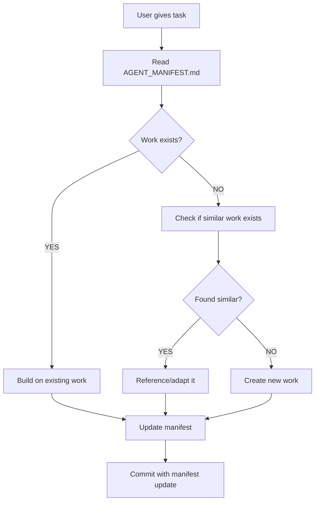

# AGENT COLLABORATION PROTOCOL
**How Claude, Cursor, Codex, and Gemini Work Together**

**Version**: 1.0
**Date**: 2025-11-12
**Purpose**: Eliminate duplicate work and ensure all AI agents stay synchronized

---

## 🎯 THE GOLDEN RULES

### Rule #1: Read Before You Code
**ALWAYS check AGENT_MANIFEST.md before starting ANY work**

```
┌──────────────────────────────────────────┐
│  Before you write a single line of code │
│         READ AGENT_MANIFEST.MD           │
└──────────────────────────────────────────┘
```

### Rule #2: One Source of Truth
**Repository**: `jckagnew/agents`
**Branch for new work**: Create `claude/*` or `cursor/*` or `codex/*` or `gemini/*`
**Main branch**: Reserved for Udemy course materials (DON'T TOUCH)

### Rule #3: Update the Manifest
**When you complete work, immediately update AGENT_MANIFEST.md**

```bash
# Your commit should include:
git add AGENT_MANIFEST.md
git add [your-work-files]
git commit -m "[AGENT_NAME] [DATE]: [What you did]"
```

---

## 📝 WORKFLOW FOR EACH AGENT

### Starting a New Task



### Step-by-Step Checklist

**1. Pre-Work Phase** (BEFORE writing code)
- [ ] Read `AGENT_MANIFEST.md` completely
- [ ] Check "COMPLETED WORK" section - does it already exist?
- [ ] Check "WORK IN PROGRESS" section - is someone else doing it?
- [ ] Check "PLANNED WORK" section - is it documented?
- [ ] Review relevant branches listed in manifest
- [ ] Read existing documentation for context

**2. Planning Phase**
- [ ] If work exists: Plan to build on it (don't recreate)
- [ ] If partially done: Plan to complete it (don't restart)
- [ ] If conflicts exist: Ask user for clarification
- [ ] Document your plan in manifest "WORK IN PROGRESS"

**3. Execution Phase**
- [ ] Create branch with naming convention: `[agent]/[description]-[session-id]`
- [ ] Reference existing code/docs in your work
- [ ] Follow existing patterns and conventions
- [ ] Test integration with existing components

**4. Completion Phase**
- [ ] Update `AGENT_MANIFEST.md` - move from "IN PROGRESS" to "COMPLETED"
- [ ] Add your work to the "WHAT EXISTS WHERE" section
- [ ] Update "DECISION LOG" if you made architectural decisions
- [ ] Commit manifest WITH your work
- [ ] Document any blockers for next agent

---

## 🤝 COMMUNICATION FORMAT

### In AGENT_MANIFEST.md Updates

```markdown
## [Section You're Updating]

[AGENT_NAME] [YYYY-MM-DD] [ACTION]: [Description]
**Location**: [branch]/[directory]/[files]
**Status**: [✅ Complete | 🔄 In Progress | ⏳ Blocked]
**Blockers**: [If any]
**Next Steps**: [What should happen next]
**Documentation**: [Links to docs you created/updated]
```

**Example**:
```markdown
Claude 2025-11-12 COMPLETED: Admin Console security fixes
**Location**: claude/security-fixes-011CV4GmG4H3M7Seg9KC2ZcP/admin-console/
**Status**: ✅ Complete
**Blockers**: None
**Next Steps**: Deploy to production after Factory backend is deployed
**Documentation**:
- /admin-console/WEB_DEPLOYMENT.md
- /admin-console/SECURITY_FIXES_SUMMARY.md
```

---

## 📂 BRANCH NAMING CONVENTION

### Format
```
[agent-name]/[description]-[session-id]
```

### Examples
- `claude/expo-factory-web-deployment-011CV4GmG4H3M7Seg9KC2ZcP`
- `cursor/database-schema-optimization-20251112`
- `codex/api-endpoint-refactoring-session-042`
- `gemini/ui-component-library-20251112`

### Rules
- Use lowercase and hyphens
- Include agent name as prefix
- Include session ID or date
- Be descriptive about the work
- Don't use `main` or `master` for your work

---

## 🔄 HANDOFF PROCEDURE

### When You're Done and Another Agent Takes Over

**Outgoing Agent Checklist**:
- [ ] Commit all changes
- [ ] Push to remote
- [ ] Update AGENT_MANIFEST.md
- [ ] Mark your work as "COMPLETED" in manifest
- [ ] Document next steps in manifest
- [ ] List any blockers
- [ ] Notify user if credentials/access needed

**Incoming Agent Checklist**:
- [ ] Read AGENT_MANIFEST.md
- [ ] Review previous agent's commits
- [ ] Check for blockers
- [ ] Understand what was completed
- [ ] Read documentation created by previous agent
- [ ] Continue from where they left off (don't restart)

### Handoff Template

Create a handoff entry in AGENT_MANIFEST.md:

```markdown
---
## HANDOFF: [From Agent] → [To Agent]
**Date**: YYYY-MM-DD
**Context**: [Brief description of what was done]
**Completed**:
- [Item 1]
- [Item 2]

**In Progress**:
- [Item that wasn't finished]

**Blockers**:
- [Any blockers]

**Next Steps for Incoming Agent**:
1. [First task]
2. [Second task]

**Important Notes**:
- [Any gotchas or important context]
---
```

---

## 🚨 CONFLICT RESOLUTION

### What to Do If You Find Conflicting Work

**Scenario 1**: Two branches with similar work
```
Solution:
1. Compare both branches
2. Identify which is more complete/recent
3. Update AGENT_MANIFEST.md to mark one as "primary"
4. Document the other as "deprecated - see [primary branch]"
5. Ask user if unsure which to use
```

**Scenario 2**: Manifest says work is done, but you can't find it
```
Solution:
1. Search all branches: git branch -a | grep [work-description]
2. Check other repos mentioned in manifest
3. If truly missing: Update manifest to mark as "MISSING - needs recreation"
4. Ask user for clarification
```

**Scenario 3**: Your work duplicates recent work by another agent
```
Solution:
1. Stop immediately
2. Review the other agent's work
3. Ask user: "Should I continue or use existing work?"
4. If existing is good: Delete your duplicate
5. If improvements needed: Build on existing, don't replace
```

---

## 📊 WORK STATUS DEFINITIONS

Use these consistently in AGENT_MANIFEST.md:

| Status | Symbol | Meaning |
|--------|--------|---------|
| Complete | ✅ | Work is done, tested, documented |
| In Progress | 🔄 | Currently being worked on |
| Blocked | ⏳ | Waiting for something (credentials, decision, etc.) |
| Planned | 📋 | Not started, but documented in roadmap |
| Deprecated | ⚠️ | Old work, don't use, see replacement |
| Missing | ❌ | Should exist but can't be found |

---

## 🧪 TESTING INTEGRATION

### Before Committing Your Work

**Integration Tests**:
- [ ] Does it work with existing Supabase project?
- [ ] Does it work with existing Edge Functions?
- [ ] Does it work with existing frontend code?
- [ ] Does it work with existing backend code?
- [ ] Have you tested cross-agent components?

**Documentation Tests**:
- [ ] Did you update AGENT_MANIFEST.md?
- [ ] Did you update INTEGRATION_ROADMAP.md if needed?
- [ ] Did you document your changes?
- [ ] Can another agent understand what you did?

---

## 📖 DOCUMENTATION STANDARDS

### When to Create New Documentation

**Create NEW doc when**:
- Introducing a completely new system
- Documenting a major feature
- Creating deployment guide for new infrastructure

**Update EXISTING doc when**:
- Adding to existing feature
- Fixing bugs in documented code
- Improving existing process

### Documentation Naming

```
[TOPIC]_[TYPE].md
```

**Examples**:
- `AGENT_MANIFEST.md` (coordination)
- `PHASE_1_DEPLOYMENT.md` (guide)
- `WEB_DEPLOYMENT.md` (guide)
- `INTEGRATION_ROADMAP.md` (planning)
- `API_REFERENCE.md` (reference)

---

## 🎯 EXAMPLES OF GOOD COLLABORATION

### Example 1: Building on Existing Work

**Cursor creates** Supabase schema
**Claude discovers** it exists via repository analysis
**Claude action**:
- ✅ Updates .env.example to reference existing project
- ✅ Updates deployment guide to use existing infrastructure
- ✅ Does NOT create new Supabase project
- ✅ Updates AGENT_MANIFEST.md documenting what exists

### Example 2: Avoiding Duplication

**Claude (Session 1)** creates deployment configs
**Claude (Session 2)** is asked to create deployment configs
**Claude action**:
- ✅ Reads AGENT_MANIFEST.md first
- ✅ Finds existing deployment configs
- ✅ Reviews existing configs
- ✅ Updates/improves them instead of creating new ones

### Example 3: Proper Handoff

**Codex** completes API endpoints
**Codex action**:
- ✅ Updates AGENT_MANIFEST.md with completed work
- ✅ Documents API in API_REFERENCE.md
- ✅ Notes that frontend integration is next step
- ✅ Commits manifest with work

**Gemini** picks up frontend work
**Gemini action**:
- ✅ Reads AGENT_MANIFEST.md
- ✅ Finds Codex's API documentation
- ✅ Builds frontend using documented API
- ✅ No time wasted searching for API details

---

## ⚠️ COMMON MISTAKES TO AVOID

### Mistake #1: "I'll just recreate it, it's faster"
**Problem**: Creates duplicates, wastes time
**Solution**: Always check manifest first, build on existing work

### Mistake #2: "I'll update the manifest later"
**Problem**: Next agent doesn't know your work exists
**Solution**: Update manifest IN THE SAME COMMIT as your work

### Mistake #3: "The manifest is outdated, I'll ignore it"
**Problem**: Breaks the whole system
**Solution**: Update the manifest to make it current!

### Mistake #4: "I'll create my own documentation structure"
**Problem**: Inconsistent, hard to find things
**Solution**: Follow existing patterns, update existing docs

### Mistake #5: "I'll work in isolation and merge later"
**Problem**: Merge conflicts, duplicate work discovered too late
**Solution**: Communicate via manifest, coordinate frequently

---

## 🚀 QUICK START FOR NEW AGENTS

**Copy/paste this checklist for every new task**:

```markdown
## Pre-Task Checklist for [Agent Name]

Date: YYYY-MM-DD
Task: [Brief description]

□ Read AGENT_MANIFEST.md completely
□ Searched for existing work related to task
□ Checked all relevant branches
□ Reviewed existing documentation
□ Identified what exists vs what's needed
□ Planned to build on existing (not recreate)
□ Created branch with proper naming
□ Ready to update manifest when done

Notes:
- [Any important findings]
- [Dependencies on other work]
- [Questions for user]
```

---

## 📞 WHEN TO ASK THE USER

**Always ask user when**:
- Work exists in multiple places (which one to use?)
- Conflicting implementations found
- Major architectural decisions needed
- Unsure if work should be recreated or updated
- Missing critical credentials or access
- Previous agent's work is unclear

**Don't ask user when**:
- You can determine answer from manifest
- Documentation is clear
- Standard patterns exist
- No conflicts or ambiguity

---

## 🎓 SUCCESS METRICS

**Good collaboration looks like**:
- ✅ No duplicate work created
- ✅ Agents building on each other's work
- ✅ AGENT_MANIFEST.md stays current
- ✅ Work is findable and documented
- ✅ Smooth handoffs between agents
- ✅ User spends less time explaining context

**Poor collaboration looks like**:
- ❌ Same work done twice
- ❌ Time wasted searching for code
- ❌ Outdated manifest
- ❌ Conflicting implementations
- ❌ Agents working in silos
- ❌ User has to re-explain everything

---

## 🔧 TOOLS AND COMMANDS

### Useful Git Commands for Multi-Agent Work

```bash
# Find all branches by all agents
git branch -a

# Search for work across branches
git log --all --grep="keyword"

# Compare branches
git diff branch1..branch2

# See what another agent did
git log --author="Claude" --oneline
git log --author="Cursor" --oneline

# Find files across all branches
git ls-tree -r --name-only branch-name | grep pattern
```

### Quick Manifest Update Template

```bash
# After completing work:
cat >> AGENT_MANIFEST.md << 'EOF'

[Agent] YYYY-MM-DD COMPLETED: [Description]
Location: [branch]/[path]
Status: ✅
Documentation: [links]
EOF

git add AGENT_MANIFEST.md
git commit -m "[Agent] YYYY-MM-DD: [What you did]"
```

---

## 📋 SUMMARY

**Before Starting Work**:
1. Read AGENT_MANIFEST.md
2. Check if work exists
3. Review existing code/docs

**While Working**:
1. Build on existing work
2. Follow existing patterns
3. Document as you go

**After Completing Work**:
1. Update AGENT_MANIFEST.md
2. Commit manifest with work
3. Document for next agent

**Remember**: We're a team of AI agents working toward the same goal. Help each other succeed!

---

**Version**: 1.0
**Last Updated**: 2025-11-12
**Maintained By**: All agents (Claude, Cursor, Codex, Gemini)
